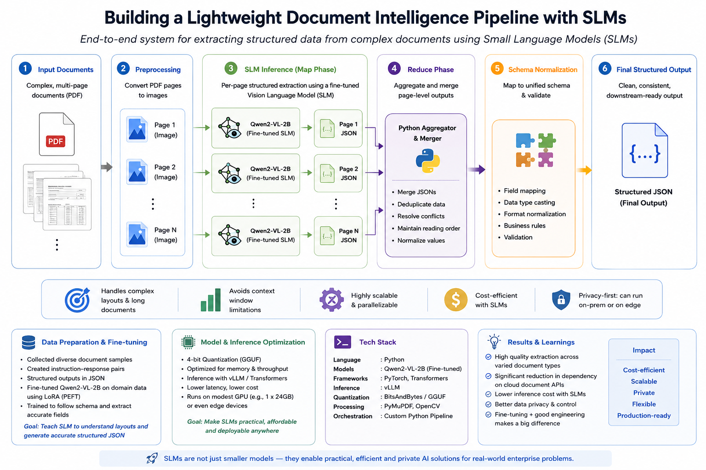

# SLM Document Extractor: Map-Reduce Architecture 🚀

An intelligent, local-first document extraction pipeline that uses Small Language Models (SLMs) to bypass context limits and eliminate expensive cloud API costs.

## The Problem
Processing multi-page, complex tabular documents (like Purchase Orders or Invoices) using standard LLMs often results in hallucinations and dropped line items due to strict token context limits. Conversely, relying on managed Cloud APIs introduces massive variable costs ($10-$50 per 1k pages) and data privacy concerns.

## The Solution: Map-Reduce Edge Processing
This pipeline utilizes **Qwen2-VL-2B** (a 2-Billion parameter Vision Language Model) running entirely locally via `llama.cpp`. 

### Domain-Specific Fine-Tuning (LoRA / PEFT)
Out-of-the-box SLMs often struggle to perfectly format nested JSON schemas or accurately map highly variable vendor jargon. To achieve production-grade accuracy, this model was **fine-tuned** on a curated dataset of complex Purchase Orders. 
- Utilized **LoRA (Low-Rank Adaptation)** to inject domain-specific knowledge into the model's attention layers without needing massive GPU clusters.
- The fine-tuning enforced strict JSON adherence and trained the model to handle diverse table layouts.

Instead of overwhelming the SLM with a 10-page document, the pipeline implements a **Map-Reduce** pattern:
1. **Map:** The PDF is sliced into individual images. The SLM evaluates each page completely independently, maintaining flawless spatial layout understanding (e.g., distinguishing embedded global headers from tabular line items).
2. **Reduce:** The Python aggregator seamlessly stitches the independent JSON outputs together and normalizes the final schema for downstream consumption.

## Key Highlights
- **100% Local & Private:** No data is sent to OpenAI, Azure, or AWS.
- **Green AI / Edge Compute:** Quantized to 4-bit `GGUF`, the model requires < 2GB of RAM and runs efficiently on standard CPUs or edge GPUs without relying on hyperscale power grids.
- **Infinite Scalability:** The Map-Reduce architecture completely solves the token-limit problem, allowing infinite-page document processing.

## Setup Instructions
1. Install `llama.cpp` and `PyMuPDF`.
2. Download the Qwen2-VL-2B GGUF weights.
3. Update the paths in `pipeline.py` to point to your local `.gguf` files.
4. Run `python pipeline.py dummy_po.pdf`

## Example Output Schema
The pipeline dynamically extracts standard PO headers and accurately tracks multi-page line items, structuring them into a strict JSON payload.
